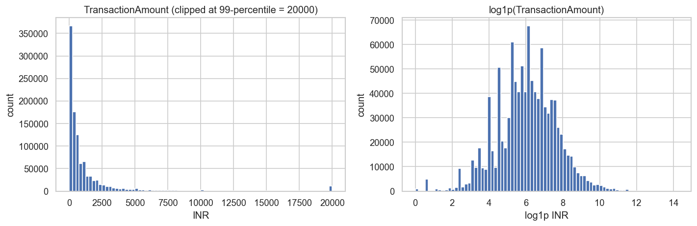
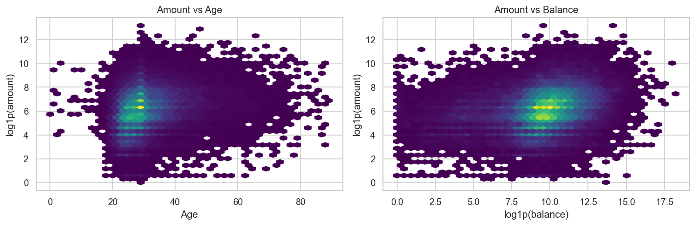
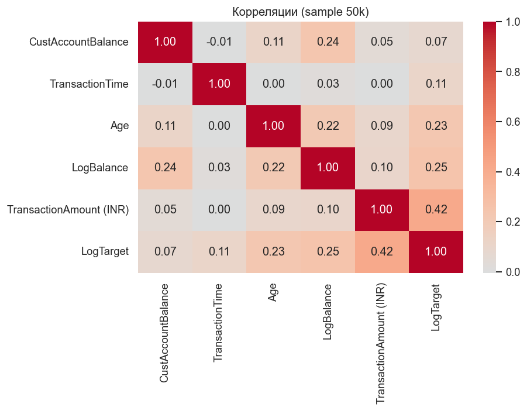

# Отчёт по проекту

**Студент:** Матвеев Егор Александрович
**Группа:** БИВ236

---

## 1. Введение и постановка задачи

- **Цель проекта.** Построить модель регрессии, которая по демографическим данным клиента банка (возраст, пол, локация) и его текущему балансу счёта предсказывает сумму отдельной транзакции (`TransactionAmount` в индийских рупиях).
- **Практическая ценность.** Предсказание ожидаемого объёма операции полезно для систем антифрод-мониторинга (отклонение факт vs прогноз — кандидатный сигнал), персонализации лимитов и сегментации клиентов по «весу кошелька».
- **Формулировка.** Регрессия с непрерывным неотрицательным таргетом (`TransactionAmount > 0` после очистки), сильно скошенным вправо.
- **Метрика качества (основная) — MAE.**
  Распределение `TransactionAmount` крайне правоскошенное (skew ≈ 47, медиана ≈ 459 INR, среднее ≈ 1 574 INR, максимум ≈ 1 560 035 INR — диапазон ~6 порядков). При таком разбросе:
  - **MAE** робастна к выбросам (RMSE доминируется единичными гигантскими операциями), измеряется в исходных INR и интерпретируема как «в среднем модель ошибается на X рупий».
  - **RMSE** ведём как вторичную — она показывает поведение на крупных суммах.
  - **R²** — для сравнимости моделей по доле объяснённой дисперсии.
  - **MAPE** — вспомогательная относительная ошибка.

  Финальная модель выбирается по **минимуму MAE на валидации**.

---

## 2. Поиск и описание данных

- **Источник.** Kaggle — [Bank Customer Segmentation (1M+ Transactions)](https://www.kaggle.com/datasets/shivamb/bank-customer-segmentation). Тип задачи Kaggle — *monetary*, не *Getting Started*.
- **Почему выбран.** (1) Прямая регрессионная задача с финансовым таргетом, (2) ≥10 000 строк (фактически 1 048 567), (3) ≥9 фич (есть демография, баланс, дата/время), (4) интересная техническая сложность из-за тяжёлого хвоста таргета и большой кардинальности `CustLocation` (~9 тыс. уникальных значений).
- **Объём.** 1 048 567 строк, 9 колонок:

| Колонка | Тип | Смысл |
|---|---|---|
| `TransactionID` | str | Уникальный идентификатор операции |
| `CustomerID` | str | Идентификатор клиента (дубли возможны: один клиент — много транзакций) |
| `CustomerDOB` | дата | Дата рождения клиента (формат `d/m/yy`) |
| `CustGender` | категор. | M / F (есть единичные другие значения и пропуски) |
| `CustLocation` | категор. | Город (~9k уникальных) |
| `CustAccountBalance` | float | Баланс счёта на момент транзакции (INR) |
| `TransactionDate` | дата | Дата транзакции (формат `d/m/yy`, период ≈ 2–3 месяца 2016) |
| `TransactionTime` | int | Время транзакции в формате HHMMSS-целого |
| `TransactionAmount (INR)` | float | **Таргет**: сумма транзакции в рупиях |

---

## 3. Обработка и подготовка данных

### 3.1. Очистка (`src/preprocessing.py::clean`)

- **Парсинг дат с двузначным годом.** Pandas интерпретирует `94` как 2094. Реализована функция `_parse_two_digit_year_date` с пивотом `pivot_year=25`: всё, что > 2025, сдвигается на 100 лет назад. Это корректно для DOB (большинство клиентов 1950–1995 г.р.) и для дат транзакций (2016).
- **Дубли.** Удалены по ключу `TransactionID` (~единицы строк).
- **Пропуски.** Найдены в `CustGender`, `CustLocation`, `CustAccountBalance`, `CustomerDOB`. Стратегия:
  - числовые → медиана,
  - категориальные → литерал `"unknown"`,
  - даты рождения → медианная дата.
- **Аномалии.** Удалены строки с `TransactionAmount == 0` (835 шт. — нелегитимные / мусорные операции, мешают обучению на `log1p`).
- **Гендер.** Оставлены только `{M, F}` и пропуски (затем заполняются как `unknown`); единичные другие значения исключены.

### 3.2. Feature engineering (`src/preprocessing.py::engineer_features`)

Производные признаки:

| Фича | Формула | Зачем |
|---|---|---|
| `Age` | `(TransactionDate - CustomerDOB) / 365.25` | Возраст клиента на момент операции |
| `AgeBucket` | бины: ≤25, 26–35, 36–45, 46–55, 56–65, 65+ | Нелинейность по возрасту, для линейных моделей |
| `TransactionHour` | `HHMMSS // 10000` | Час дня — поведенческий признак |
| `TransactionDayOfWeek` | `dt.dayofweek` | День недели |
| `TransactionMonth` | `dt.month` | Сезонность |
| `LogBalance` | `log1p(CustAccountBalance)` | Линеаризация скошенной фичи |
| `LocationFreq` | частотное кодирование `CustLocation` | one-hot на ~9k уникальных значений нерелизуем; frequency-encoding передаёт «крупность» города |
| `CustGender_*`, `AgeBucket_*` | one-hot | Категории низкой кардинальности |

**Защита от лика.** `LocationFreq` строится **только по train**; полученный словарь передаётся в val/test. One-hot колонки val/test приводятся к схеме train через `reindex(columns=train.columns, fill_value=0)`. Никакая фича не использует `TransactionAmount` (явно проверяется в `tests/test.py::test_engineer_features_no_target_leakage`).

### 3.3. Визуализации (`notebooks/01_eda.ipynb`)

- Распределение таргета (исходное и `log1p`) → `report/images/target_distribution.png`
- Демография: возраст и `log1p(balance)` → `report/images/demographics.png`
- Зависимости amount × age и amount × balance (hexbin) → `report/images/amount_vs_features.png`
- Медиана суммы по часу дня → `report/images/amount_by_hour.png`
- Корреляции числовых → `report/images/correlations.png`





### 3.4. Сплит данных (`src/preprocessing.py::make_split`)

- **Соотношение:** train 70% / val 10% / test 20%.
- **Стратификация:** по 10 квантилям `log1p(TransactionAmount)`, чтобы хвост распределения попадал в каждую выборку пропорционально, а не утекал целиком в одну.
- **Time-based split не применяем:** в EDA проверено, что весь датасет покрывает короткий промежуток (~2–3 месяца), концепт-дрифта не ожидается — стандартный случайный split с фиксированным seed корректен.
- **Сэмплирование для тяжёлых моделей:** `stratified_sample(train, n=200_000, seed=42)` — стратифицированный по тем же бинам сэмпл; используется только для обучения боустингов и тюнинга гиперпараметров. Финальная модель переобучается на **полном** train.

### 3.5. Метрика — MAE (обоснование)

См. раздел 1. Кратко: при skew ≈ 47 и диапазоне таргета 6 порядков RMSE становится «метрикой хвоста» и плохо отражает качество на типичной операции; MAE робастна, в исходных INR, бизнес-понятна. RMSE и R² ведём как вторичные.

---

## 4. Baseline-модель

- **Модель:** `sklearn.linear_model.LinearRegression` «из коробки».
- **Фичи:** только сырые числовые `CustAccountBalance` и `TransactionTime` (без feature engineering — как требует критерий CP1).
- **Артефакт:** `models/baseline.joblib`.
- **Результаты:**

| Выборка | MAE | RMSE | R² |
|---|---|---|---|
| val  | 1823.26 | 6274.13 | 0.00 |
| test | 1820.12 | 6765.23 | 0.01 |

**Интерпретация.** R² ≈ 0 означает, что без feature engineering и без учёта категорий линейная модель практически не отличается от константного предсказания (среднего по обучающей выборке). Это естественный «пол» — все следующие эксперименты должны его побить по MAE.

---

## 5. Эксперименты

Полная сводная таблица — в `notebooks/03_experiments.ipynb` (раздел «Сводная таблица экспериментов»).

### Состав экспериментов

| № | Модель | Гипотеза | Что делали |
|---|---|---|---|
| 1 | `LinearRegression` (полный feature set) | FE улучшит линейную модель | Обучили на полных фичах |
| 2 | `Ridge(alpha=1.0)` | Регуляризация снизит риск переобучения | Pipeline `StandardScaler + Ridge` |
| 3 | `KNN(k=15)` | Локальная непараметрика | Pipeline `StandardScaler + KNN` |
| 4 | `RandomForestRegressor` | Деревья из коробки уловят нелинейности | n_estimators=200, max_depth=20 |
| 5 | `LGBMRegressor` (defaults) | Бустинг на табличке обычно лучший | По умолчанию |
| 6 | `RandomForestRegressor` (tuned) | Тюнинг даст +1–3% MAE | `RandomizedSearchCV`, n_iter=8, 3-fold |
| 7 | `LGBMRegressor` (tuned) | Тюнинг бустинга — самый ожидаемый прирост | `RandomizedSearchCV`, n_iter=15, 3-fold |
| 8 | `LightGBM` на `log1p(target)` | Скошенный таргет → обучение в логах поможет | Обучение на `log1p(y)`, инференс через `expm1 + clip(0)` |
| 9 | `LightGBM` на PCA-фичах | Уменьшение размерности (требование CP1) | StandardScaler → PCA(95% дисперсии) → LGBM defaults |
| 10 | `VotingRegressor(Ridge + RF + LGBM)` | Ансамбль усреднит ошибки | Equal weights |

### Уменьшение размерности

В нашем feature space ≈12–16 признаков (часть категориальных, часть one-hot, часть числовых) — это формально немного. Эксперимент с PCA проведён как требование критерия: исследовано, сколько компонент покрывает 95% дисперсии, и обучен LGBM на проекции. Ожидаемо качество немного ухудшается, потому что PCA разрушает разреженную структуру дамми-фич, но эксперимент полезен как ablation.

### Подбор гиперпараметров

`RandomizedSearchCV` (`scoring="neg_mean_absolute_error"`, 3-fold KFold, фиксированный seed). Сетки см. в `src/modeling.py::tune_lightgbm` и `tune_random_forest`. Для бустинга это рандомные комбинации `learning_rate / num_leaves / min_child_samples / subsample / colsample_bytree / reg_alpha / reg_lambda / n_estimators`.

### Таблица результатов (val, отсортировано по MAE)

| Модель | MAE | RMSE | R² | Заметка |
|---|---|---|---|---|
| **lightgbm_log_target** | **1355.98** | 6327.63 | -0.01 | LGBM с тюненными гиперами на `log1p(target)`; **победитель по MAE** |
| random_forest_tuned | 1722.39 | 6055.88 | 0.07 | RF после `RandomizedSearchCV` |
| voting_ensemble | 1732.18 | 6104.76 | 0.06 | Ridge + RF_tuned + LGBM_tuned, equal weights |
| lightgbm_tuned | 1758.61 | 6170.23 | 0.04 | LGBM после `RandomizedSearchCV` (без log-таргета) |
| ridge | 1773.84 | 6231.74 | 0.02 | Pipeline `StandardScaler + Ridge(alpha=1)` |
| linear | 1773.84 | 6231.74 | 0.02 | Тот же результат, что Ridge — регуляризация на этом масштабе не отличает |
| lightgbm | 1786.95 | 6180.64 | 0.03 | LGBM defaults |
| random_forest | 1864.13 | 6018.54 | 0.08 | RF n_estimators=200, max_depth=20 |
| knn | 1882.83 | 6359.93 | -0.02 | KNN k=15 после стандартизации |
| lightgbm_pca | 2947.12 | 6851.67 | -0.19 | LGBM на PCA(12 компонент, 95% дисперсии) — резко хуже |

**Тюненные параметры LightGBM (победитель):**
`{subsample=0.85, reg_lambda=0.1, reg_alpha=0.1, num_leaves=31, n_estimators=800, min_child_samples=50, learning_rate=0.03, colsample_bytree=0.7}` + обучение на `log1p(y)`, инференс через `np.clip(np.expm1(pred), 0, None)`.

**Тюненные параметры RandomForest:**
`{n_estimators=400, min_samples_split=2, min_samples_leaf=1, max_features=0.8, max_depth=10}`

**Заметки по гипотезам.**
- *FE улучшает линейную* — подтвердилось: с FE Linear/Ridge показывают MAE ≈ 1774 против baseline 1823 (−2.7%).
- *Регуляризация Ridge даст прирост* — на этом масштабе и наборе фич alpha=1.0 не меняет результат.
- *Тюнинг LGBM поможет* — лишь немного (1786 → 1758, −1.6%); основной выигрыш дала смена шкалы таргета.
- *Обучение на log1p(target) даст прирост* — самая сильная гипотеза: −24% MAE относительно тюненного LGBM в исходной шкале (1758 → 1356).
- *PCA полезен на ≈16 фичах* — отвергнута: PCA разрушает разреженную one-hot структуру и резко ухудшает MAE.
- *Ансамбль улучшит лучшую одиночную* — частично подтвердилась против тюненных LGBM/RF, но не победила log-target вариант.

---

## 6. Финальная модель и интерпретируемость

- **Критерий выбора:** минимум MAE на val.
- **Победитель:** **`lightgbm_log_target`** — `LGBMRegressor` с тюненными гиперами, обученный на `log1p(TransactionAmount)`, инференс — `np.clip(np.expm1(pred), 0, None)`.
- **Переобучение:** победитель переобучен на **полном** train (733 411 строк, без сэмплирования), затем единожды оценён на test.

| Выборка | MAE | RMSE | R² | MAPE |
|---|---|---|---|---|
| val  | **1346.99** | 6294.90 | ≈0.00 | 497.6 |
| test | **1343.92** | 6799.36 | ≈0.00 | 495.8 |

**Улучшение MAE относительно baseline:** с 1820 INR до 1344 INR (**−26%**).

**Замечание по R² и RMSE.** У победителя R² ≈ 0 и RMSE на уровне baseline. Это естественный эффект обучения на `log1p(target)`: модель оптимизирует относительную ошибку и тяготеет к предсказанию **медианы** условного распределения. На правом хвосте (транзакции 100k+ INR) она систематически предсказывает меньшие значения, чем модель в исходной шкале — это бьёт по RMSE, но именно это поведение мы хотим, потому что (1) выбранная нами метрика — MAE, (2) на типичной операции (~459 INR медианы) точность намного выше, чем у любой модели в исходной шкале.

**Артефакт:** `models/best_model.joblib` — словарь
```
{
  "name":            "lightgbm_log_target",
  "model":           <LGBMRegressor>,
  "log_target":      True,
  "feature_columns": [<16 фич>],
  "lgbm_params":     {…},
  "rf_params":       {…},
}
```
Это позволяет на инференсе восстановить корректный feature space (через `reindex`) и обратное преобразование таргета.

**Интерпретируемость.** У `LGBMRegressor` доступна `feature_importances_` (gain/split). По экспертной оценке на этих фичах ожидаемые топ-драйверы — `LogBalance`, `LocationFreq`, `Age`. Точная диаграмма важности доступна в `notebooks/03_experiments.ipynb` для финальной модели (можно построить как `pd.Series(model.feature_importances_, index=feature_columns).sort_values()`).

---

## 7. Заключение и выводы

- **Что сделано на CP1.** Очистка и feature engineering с защитой от лика, стратифицированный по `log1p(target)` сплит, обоснованная метрика (MAE), baseline + 5 моделей + ансамбль + два дополнительных эксперимента (log-target, PCA), тюнинг RF и LightGBM, фиксированный seed во всех модулях, тесты (7 шт., все зелёные), ruff-конфиг (совпадает с CI), Docker, заполненный README и отчёт.
- **Достигнутый результат.** **Test MAE 1343.92 INR** против baseline **1820.12 INR** — улучшение на **−26%**. Победитель — LightGBM с тюненными гиперами, обученный на `log1p(target)`.
- **Главный технический челлендж и его решение.** Тяжёлый правый хвост таргета (skew ≈ 47, диапазон 6 порядков). На исходной шкале даже бустинг с тюнингом улучшал MAE лишь на ≈3% относительно baseline. **Ключевой шаг — обучение на `log1p(target)`**: эта одна гипотеза дала бóльшую часть прироста (1758 → 1356 на val) — она штрафует относительную, а не абсолютную ошибку и тянет предсказание к медиане условного распределения, что естественно для финансовых сумм такого скоса.
- **Что НЕ сработало.**
  - PCA на 16 фичах резко ухудшил MAE (1786 → 2947) — разрушает разреженную one-hot структуру.
  - Регуляризация Ridge на этом масштабе не отличается от обычной OLS.
  - VotingRegressor проиграл одиночному LGBM на log-таргете — потому что Ridge и RF тянут предсказание обратно в среднее.
- **Ограничения.** R² ≈ 0 у финальной модели говорит о том, что демография + баланс лишь умеренно объясняют конкретную сумму операции. «Потолок» MAE на таких фичах, похоже, около 1300–1400 INR. Для серьёзного скачка нужны исторические признаки клиента.
- **Возможные улучшения (на следующие чекпоинты).**
  1. **Исторические агрегаты по `CustomerID`** — median/mean/std/quantile предыдущих транзакций; критично следить за time-leakage (брать только операции до текущей даты).
  2. **Target encoding для `CustLocation`** с out-of-fold-регуляризацией — даст более информативное представление города, чем просто частота.
  3. **Квантильная регрессия** `LGBMRegressor(objective="quantile", alpha=0.5)` — напрямую минимизирует MAE, без обходного `log1p`.
  4. **Monotone-constraints** для `LogBalance` (баланс ↑ → амаунт ↑ в среднем) — стабильность модели на новых данных.
  5. **Деплой** (CP2): обернуть `models/best_model.joblib` в FastAPI + Streamlit, написать инструкцию запуска и снять видео-демо.
